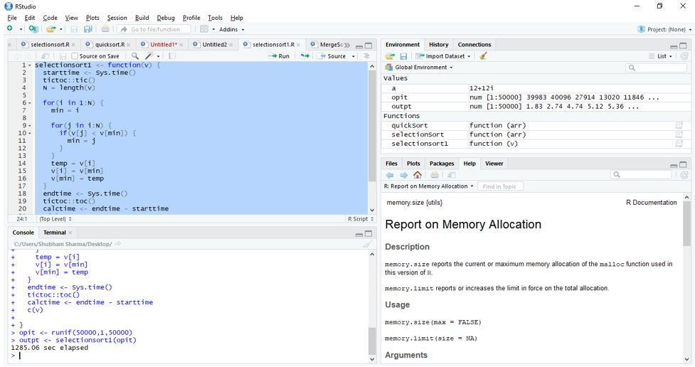

# Development-of-R-libraries-in-C
R is a language and environment for statistical computing and graphics. It includes an effective data handling and storage facility, a large, coherent, integrated collection of intermediate tools for data analysis. We aim to develop R libraries to deliver good performance, it will support basic form operations and understanding the space time complexity in different platforms.

# How to Build .so file from .c file using gcc on Linux (Ubuntu) Terminal
`gcc -shared -o sortingLibrary.so -fPIC sortingLibrary.c`

# Steps to load the .so file on R Console using Terminal :
`dyn.load('sortingLibrary.so')`

`.C("main")`

# Execution result may vary according to the system configuration
* Processor : Intel Core i5
* RAM : 8 GB
* System Type : 64 bit Operating System

# Time Complexity on RStudio

* Sorting 50000 Random Numbers Using Selection Sort

